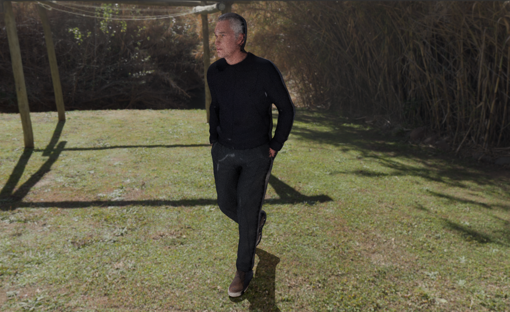
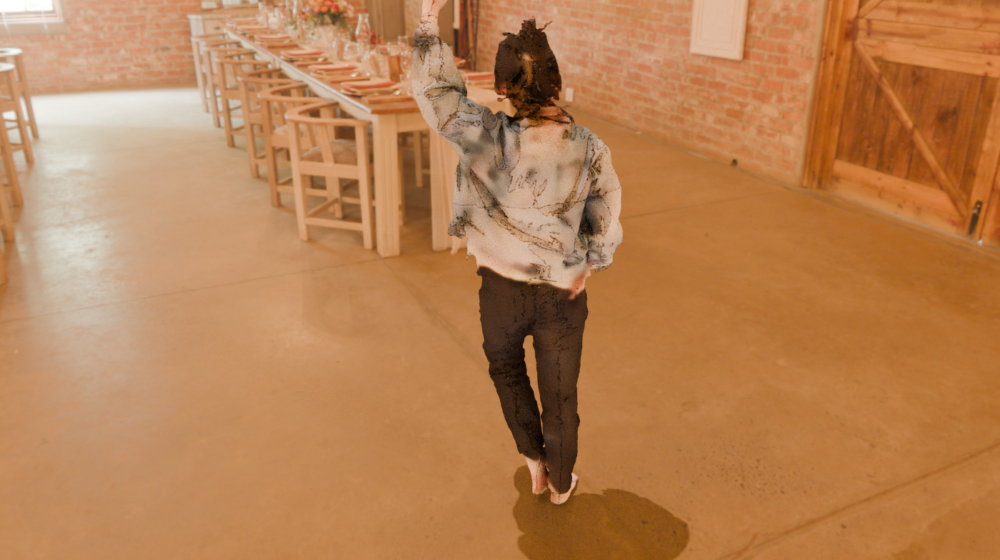
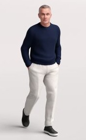
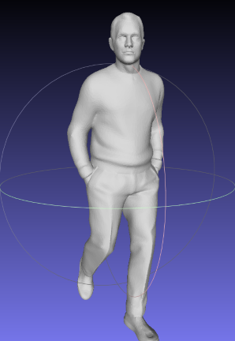
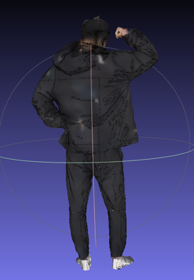
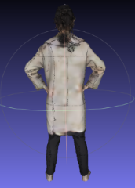
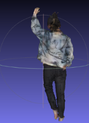
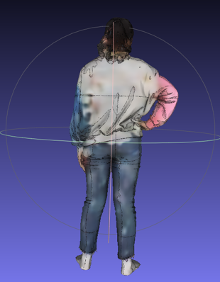
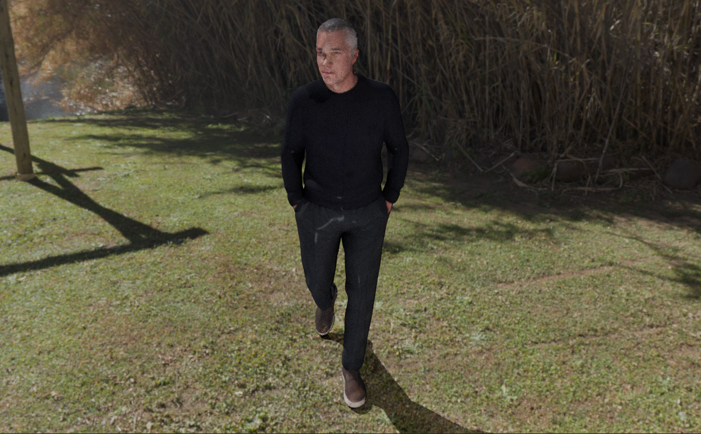
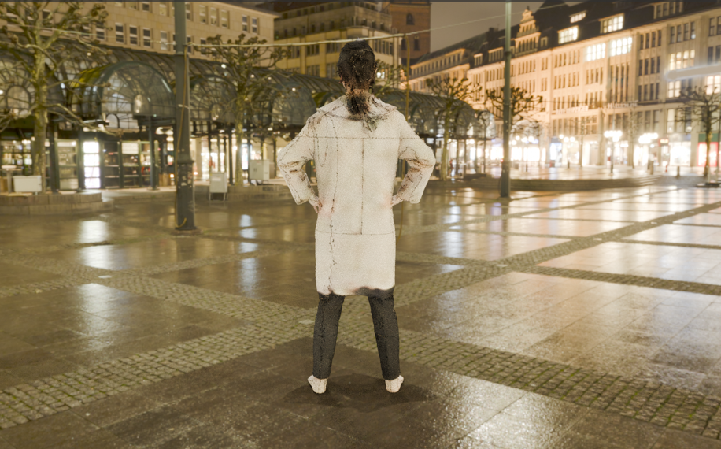

# Backside Texture Prediction and 360-Degree Background Rendering for 3D Virtual Try-On



## Overview
This project consists of two main components:

- **1: Backside Texture Prediction**  
   Generating a colored 3D human model, including the unseen backside, from a single front-view image and a colorless 3D human mesh.

- **2: 3D Background Augmentation**  
   Placing the generated 3D human model into a natural 3D environment to create realistic scenes.
## **1. Backside Texture Prediction**  
## 1.1: Preprocessing
Before training or inference, input images must be preprocessed.

### Face Detection

Face regions are detected using a pre-trained YOLOv8 model.

We use the implementation provided by:

lindevs,  
"YOLOv8-Face: Pre-trained YOLOv8 Face Detection Models,"  
GitHub repository.  
Available: https://github.com/lindevs/yolov8-face

Example preprocessing script:

```bash
python extract_face.py
```
## 1.2: Requirements

### 1.2.1. Hardware & System

- **OS:** Ubuntu 20.04 LTS (Linux recommended)
- **GPU:** NVIDIA GPU with CUDA support (≥ 12GB VRAM recommended)
- **CUDA Toolkit:** 11.8
- **Compiler:** `gcc` / `g++` (required for building PyTorch3D)

### 1.2.2. Software

- **Python:** 3.10.19
- **torch:** 2.0.1
- **torchvision:** 0.15.2
- **Pillow:** 10.0.0
- **numpy:** 1.26.4
- **matplotlib:** 3.8.0
- **ninja**
- **fvcore**
- **iopath**
### 1.2.3. Build Dependencies
To run this project, you need the following libraries. You can install them using `pip`:

```bash
pip install -r requirements.txt
```

PyTorch3D must be installed separately due to CUDA compatibility.

Please follow the official instructions:

https://github.com/facebookresearch/pytorch3d/blob/main/INSTALL.md

Example installation:

```bash
git clone https://github.com/facebookresearch/pytorch3d.git
cd pytorch3d
pip install . --no-build-isolation
```

### 1.2.4. Download Pre-trained model
Run the following script to download the pretrained model. The checkpoint is saved under ./checkpoints/.
```bash
sh ./scripts/download_trained_model.sh
```
### 1.2.5. Dataset


This project requires the **THuman3.0 dataset**.

The dataset is not included in this repository due to license restrictions.  
Please download it from the official source:

Z. Su et al.,  
"THuman3.0 Dataset," Dataset, 2022.  
Available: https://github.com/fwbx529/THuman3.0-Dataset

## 1.3: Usage
### 1.3.1. Prepare Input Data

First, detect the face region using **YOLOv8-Face**.

Then, record the bounding box coordinates of the detected face and save them in a file named `extracted_face.txt`.

The file should contain the coordinates of the face bounding box in the following format:
```bash
x_top_left y_top_left x_bottom_right y_bottom_right
```

Example:
```bash
120 85 260 220
```
After preparing the face coordinates, organize the dataset as follows:
```bash
data/
└── THuman3.0/
    └── 00001_0003/
        ├── 00001_0003.png # input image
        ├── mesh.obj # 3D human mesh
        ├── tex.png # ground-truth texture
        ├── tex.mtl # material file
        └── extracted_face.txt # face bounding box coordinates
```

Each directory corresponds to one human model from the THuman3.0 dataset.

Reference example of input data (not from the THuman3.0 dataset).




The left image shows the front-view image, while the right image shows the colorless 3D human model.
### 1.3.2. Train the Model

To train the backside texture prediction model, run:

```bash
python train.py
```
### 1.3.3. Predict Backside Texture

To generate the backside texture from a front-view image, run:

```bash
python predict_uv.py
```
## 1.4: Results
The following examples show a 3D human model with predicted backside textures generated from a single front-view image and a colorless 3D human mesh.







## **2: 3D Background Augmentation**  

## 2.1: Requirements

### 2.1.1. Software
This stage requires **Blender 4.4**.

Download Blender from:
https://www.blender.org/

The rendering script is executed using Blender's Python API (`bpy`).

### 2.1.2. Download EXR file
Please download the HDRI background asset used in this project from the following source:

G. Zaal,  
**"Rathaus"** (HDRI Asset), Poly Haven.  
Available: https://polyhaven.com/a/rathaus

This EXR file is used as the 3D background environment for rendering.

Place the downloaded file in:
```text
assets/
└── hdri/
    └── rathaus.exr
```
## 2.2: Usage

### 2.2.1. Prepare Input Data
This stage uses the colored 3D human model generated in **Stage 1** and the downloaded **EXR file** as inputs.  
No changes to the file locations are required.
### 2.2.2. Scene Composition
To generate the composed 3D scene, run:

```bash
blender -b --python scene_composition.py
```
## 2.3: Results
The following images show the output results obtained by combining the colored 3D human model with a 3D background.



## Citation

If you use this code in your research, please cite this repository.

## License

The code in this repository is released under the MIT License.

Note that datasets and assets used in this project are not included in this repository and are subject to their respective licenses.

## Acknowledgements

This project uses the following resources:

- **[THuman3.0 Dataset](https://github.com/fwbx529/THuman3.0-Dataset)**  (by Z. Su et al)
  
- **[YOLOv8 Face Detection](https://github.com/lindevs/yolov8-face)**  

- **[Poly Haven HDRI – Rathaus](https://polyhaven.com/a/rathaus)** (by G. Zaal)

- **[Humano3D – Posed New Free Model](https://humano3d.com/product/posed-new-free-models/?attribute_choose-file-format=Other+Software+%28Obj%2BFbx%29)** 


## Contact

If you have any questions, please feel free to open an issue.


